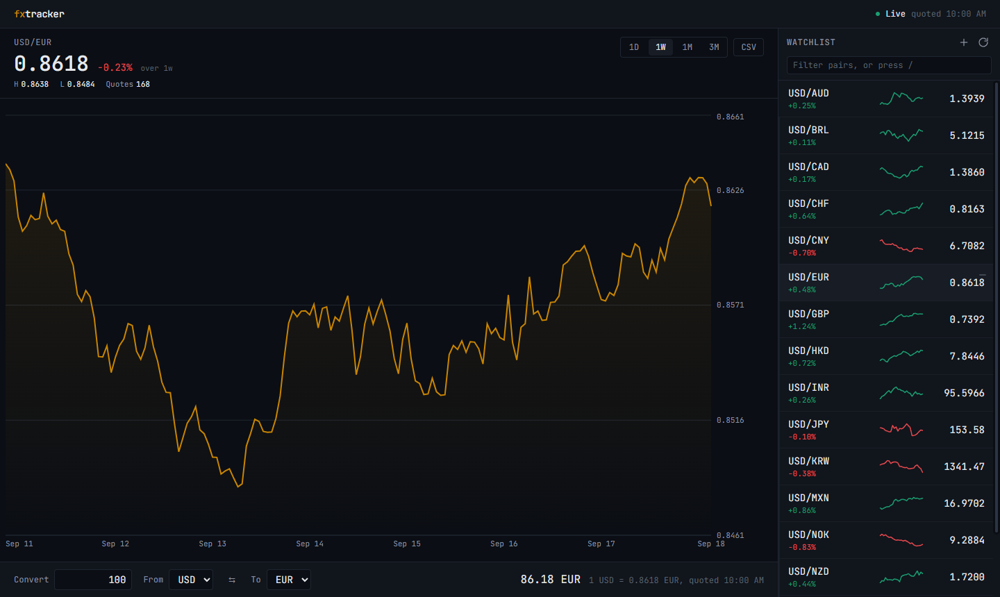

# Currency Tracker

A small foreign exchange terminal. It pulls quotes for about 170 currencies
once an hour, keeps every one of them, and shows the ones you care about as a
watchlist with a chart, a converter, and a CSV export.

FastAPI and SQLite behind, React and TypeScript in front. No database server
to run.



## What it does

- Watches a curated set of pairs out of everything the provider quotes. The
  rest are stored anyway, so a pair added later already has history.
- Charts any range from a day to three months at full resolution, one point
  per quote, with the change over the range and the high and low.
- Prices any two currencies against each other, including pairs the provider
  never quotes, and says how the number was arrived at: quoted, inverted, or
  crossed through a third currency.
- Exports the range on screen as CSV.
- Reports its own health, and refreshes on the hour without being asked.

The whole thing is usable from the keyboard: arrows walk the watchlist,
`/` jumps to the filter, Enter selects.

## Running it

You need Python 3.11 or newer, Node 22 or newer, and a free access key from
[exchangerate.host](https://exchangerate.host). That key is the only
configuration with no default.

Backend:

```bash
cd backend
python -m venv venv && venv/Scripts/activate     # macOS/Linux: source venv/bin/activate
pip install -r requirements.txt
cp .env.example .env                              # then fill in EXCHANGE_RATE_API_KEY
alembic upgrade head
uvicorn app.main:app --reload
```

Frontend, in a second terminal:

```bash
cd frontend
npm ci
npm run dev
```

Open http://localhost:5173. The watchlist starts empty until the first
refresh; press the refresh button or wait for the top of the hour. Interactive
API docs are at http://localhost:8000/docs.

Every other setting in `backend/.env.example` has a working default. Set
`DATABASE_URL` to put the SQLite file somewhere other than `backend/`, and
`VITE_API_URL` in `frontend/.env` if the API is not on localhost:8000.

## API

| Method | Path | |
|---|---|---|
| `GET` | `/health` | Database reachability, pair count, newest quote. 503 when the database is down. |
| `GET` | `/rates/latest` | Newest rate for every watched pair, with the trailing-day change and sparkline points. |
| `GET` | `/rates/history` | Every quote for one pair between two timestamps. |
| `GET` | `/rates/history.csv` | The same range as a download. |
| `GET` | `/rates/convert` | Price `base` against `target`, deriving the rate when it is not quoted directly. |
| `GET` | `/rates/pairs` | Every pair held, watched or not, with its history depth. |
| `PATCH` | `/rates/pairs/{base}/{target}` | Put a pair on the watchlist or take it off. History is kept either way. |
| `DELETE` | `/rates/pairs/{base}/{target}` | Drop a pair and its history. The hourly refresh will recreate the pair. |
| `POST` | `/rates/fetch-now` | Pull quotes now rather than waiting for the hour. |

Currency codes are validated at the edge and may be given in either case.
Timestamps are ISO 8601 and always UTC.

## How it is built

**Backend.** FastAPI with pydantic response models, SQLAlchemy, Alembic for
the schema, APScheduler for the hourly job, and httpx to talk to the
provider. The provider client and the persistence layer are separate modules
with a plain dataclass between them, so parsing is tested without a socket.

A few decisions worth knowing about:

- **SQLite on purpose.** One writer appending about 170 rows an hour, a
  handful of indexed reads, and data that can be re-fetched. Foreign keys and
  WAL are switched on per connection, since SQLite leaves both off by default
  and the schema relies on the first.
- **Timestamps are aware UTC end to end.** SQLite has no timezone type, so a
  small type decorator refuses naive input and re-attaches UTC on the way out.
  Rates carry the provider's own quote time, not the moment we asked.
- **Constant query counts.** A refresh is four statements however many
  currencies come back, using `ON CONFLICT DO NOTHING` rather than a check
  then an insert. The watchlist is two statements however many pairs are on
  it. Tests assert both numbers.
- **Cross rates are dated by their staler leg**, and the response says which
  currency they were crossed through, so a computed number is never mistaken
  for a quoted one.
- **A migration drift test.** Autogenerate is run against the models in the
  suite and must find nothing, so a model change without a matching revision
  fails CI.

**Frontend.** React 19, Redux Toolkit Query for the API layer, Recharts,
Tailwind with the palette defined once in `src/theme.ts`. Tests use Vitest,
Testing Library and msw at the network boundary, so the real query layer and
cache run under test.

- Rates show at a precision that follows their magnitude, the way a dealing
  screen does: `156.02`, `0.8600`, `0.00001235`.
- The chart's visible range has a floor, so a pegged pair's rounding noise
  reads as flat rather than as a rally.
- The converter fetches a rate once per pair and multiplies locally; typing an
  amount never hits the network.
- A refetch holds the previous render at reduced opacity rather than flashing
  a spinner.

## Development

```bash
cd backend
pip install -r requirements-dev.txt
pytest
ruff check . && ruff format --check .
alembic revision --autogenerate -m "what changed"    # after a model change
python scripts/seed_demo.py --days 7                 # synthetic history, for a populated chart
```

```bash
cd frontend
npm test
npm run lint && npm run typecheck
```

CI runs all of the above on every push. The backend suite runs against an
in-memory database and never contacts the network.
